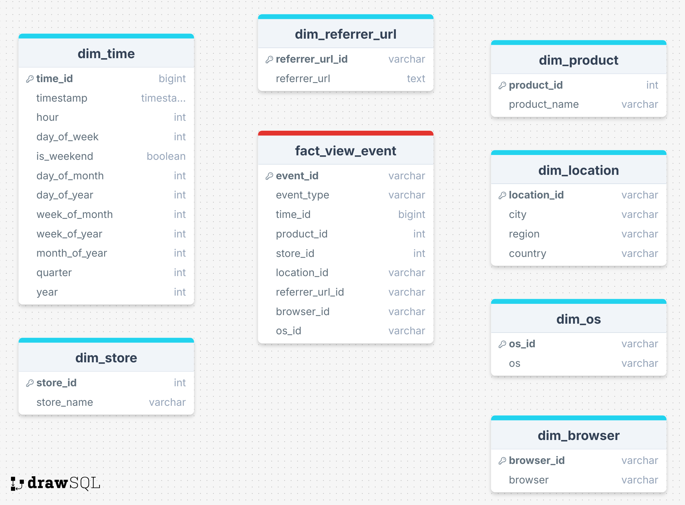
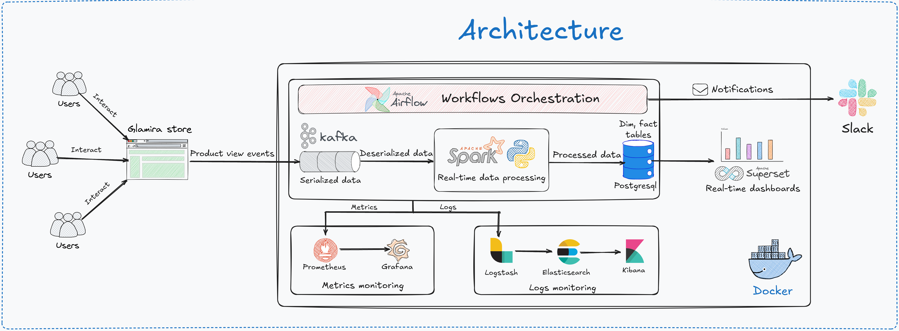

<h1 align="center">Real-time User Behavior Analytics Pipeline</h1>

## Table of contents
&nbsp;&nbsp;&nbsp;&nbsp;&nbsp;&nbsp;&nbsp;[Overview](#overview)<br>
&nbsp;&nbsp;&nbsp;&nbsp;&nbsp;&nbsp;&nbsp;[Bussiness Requirements](#business-requirements)<br>
&nbsp;&nbsp;&nbsp;&nbsp;&nbsp;&nbsp;&nbsp;[Data Source](#data-source)<br>
&nbsp;&nbsp;&nbsp;&nbsp;&nbsp;&nbsp;&nbsp;[Data Warehouse Design](#data-warehouse-design)<br>
&nbsp;&nbsp;&nbsp;&nbsp;&nbsp;&nbsp;&nbsp;[System Architecture & Technologies Used](#system-architecture--technologies-used)<br>
&nbsp;&nbsp;&nbsp;&nbsp;&nbsp;&nbsp;&nbsp;[Deployment & Operation](#deployment--operation)<br>
&nbsp;&nbsp;&nbsp;&nbsp;&nbsp;&nbsp;&nbsp;[System Monitoring](#system-monitoring)<br>

## Overview
&nbsp;&nbsp;&nbsp;&nbsp;&nbsp;&nbsp;&nbsp;&nbsp;This data pipeline is designed to capture, process, and analyze real-time user behavior data from the Glamira e-commerce platform. The primary goal is to help business and marketing teams gain insights into customer interactions, such as page views, clicks, and product engagement, to improve conversion rates, optimize UX/UI, and drive data-informed marketing decisions.
## Business Requirements
&nbsp;&nbsp;&nbsp;📌 **Business Objective**<br>
&nbsp;&nbsp;&nbsp;&nbsp;&nbsp;&nbsp;&nbsp;&nbsp;Improve real-time understanding of user behavior in order to:<br>
&nbsp;&nbsp;&nbsp;&nbsp;&nbsp;&nbsp;&nbsp;&nbsp; - Optimize user experience on the website.<br>
&nbsp;&nbsp;&nbsp;&nbsp;&nbsp;&nbsp;&nbsp;&nbsp; - Increase conversion rates and revenue.<br>
&nbsp;&nbsp;&nbsp;&nbsp;&nbsp;&nbsp;&nbsp;&nbsp; - Provide real-time dashboards for marketing, sales, and product teams.<br><br>
&nbsp;&nbsp;&nbsp;📌 **Problem Statement**<br>
&nbsp;&nbsp;&nbsp;&nbsp;&nbsp;&nbsp;&nbsp;&nbsp;Currently, the company:<br>
&nbsp;&nbsp;&nbsp;&nbsp;&nbsp;&nbsp;&nbsp;&nbsp; - Lacks real-time visibility into user behavior on the website. <br>
&nbsp;&nbsp;&nbsp;&nbsp;&nbsp;&nbsp;&nbsp;&nbsp; - Relies on batch reports that are delayed by hours or days.<br>
&nbsp;&nbsp;&nbsp;&nbsp;&nbsp;&nbsp;&nbsp;&nbsp; - Cannot respond quickly to technical issues, marketing campaigns, or anomalies.<br><br>
&nbsp;&nbsp;&nbsp;📌 **Scope**<br>
&nbsp;&nbsp;&nbsp;&nbsp;&nbsp;&nbsp;&nbsp;&nbsp;The system should:<br>
&nbsp;&nbsp;&nbsp;&nbsp;&nbsp;&nbsp;&nbsp;&nbsp; - Collect user behavior data from the website (clicks, views, searches, etc.)<br>
&nbsp;&nbsp;&nbsp;&nbsp;&nbsp;&nbsp;&nbsp;&nbsp; - Process, clean, and normalize data (~ 1.200.000 events/day) in near real-time.<br>
&nbsp;&nbsp;&nbsp;&nbsp;&nbsp;&nbsp;&nbsp;&nbsp; - Feed data into real-time dashboards (e.g., Apache Superset).<br>
&nbsp;&nbsp;&nbsp;&nbsp;&nbsp;&nbsp;&nbsp;&nbsp; - Ensure low latency (<1 minute from user action to data warehouse).<br>
&nbsp;&nbsp;&nbsp;&nbsp;&nbsp;&nbsp;&nbsp;&nbsp; - Store processed data in a data warehouse (PostgreSQL) for deeper analysis.<br><br>
&nbsp;&nbsp;&nbsp;📌 **Key Metrics / KPIs**<br>
&nbsp;&nbsp;&nbsp;&nbsp;&nbsp;&nbsp;&nbsp;&nbsp;Critical metrics to track include:<br>
&nbsp;&nbsp;&nbsp;&nbsp;&nbsp;&nbsp;&nbsp;&nbsp; - Top 10 product_ids with the highest number of views for the current day<br>
&nbsp;&nbsp;&nbsp;&nbsp;&nbsp;&nbsp;&nbsp;&nbsp; - Top 10 countries with the highest number of views for the current day (country is determined based on the domain)<br>
&nbsp;&nbsp;&nbsp;&nbsp;&nbsp;&nbsp;&nbsp;&nbsp; - Top 5 referrer_urls with the highest number of views for the current day<br>
&nbsp;&nbsp;&nbsp;&nbsp;&nbsp;&nbsp;&nbsp;&nbsp; - For a given country, retrieve a list of store_ids and their corresponding view counts, sorted in descending order of views<br>
&nbsp;&nbsp;&nbsp;&nbsp;&nbsp;&nbsp;&nbsp;&nbsp; - Hourly distribution of views for a given product_id on the current day<br>
&nbsp;&nbsp;&nbsp;&nbsp;&nbsp;&nbsp;&nbsp;&nbsp; - Hourly view distribution by each browser and os on the current day<br><br>

## Data Source
&nbsp;&nbsp;&nbsp;&nbsp;&nbsp;&nbsp;&nbsp;&nbsp;The primary data source of this pipeline is real-time user behavior data collected from interactions on the Glamira website across various devices and browsers. This includes actions such as viewing products, clicking banners, adding items to the cart, and initiating checkout. Once captured, these events are sent directly to Kafka, which acts as the data transport layer for the pipeline, enabling further transformation and processing downstream.

&nbsp;&nbsp;&nbsp;📌 **Key Characteristics:**<br><br>
&nbsp;&nbsp;&nbsp;&nbsp;&nbsp;&nbsp;&nbsp;&nbsp;&nbsp;**Type:** Event-based, JSON format<br>
&nbsp;&nbsp;&nbsp;&nbsp;&nbsp;&nbsp;&nbsp;&nbsp;&nbsp;**Transport:** Sent to a Kafka topic ```product_views```<br>
&nbsp;&nbsp;&nbsp;&nbsp;&nbsp;&nbsp;&nbsp;&nbsp;&nbsp;**Latency:** Sub-second (streaming)<br>
&nbsp;&nbsp;&nbsp;&nbsp;&nbsp;&nbsp;&nbsp;&nbsp;&nbsp;**Volume:** Thousands of events per minute (depending on traffic)<br><br>

&nbsp;&nbsp;&nbsp;🧾 **Typical Event Schema (JSON)**<br><br>

| Field Name     | Data Type | Mode     | Description                                          | Example                                                                                                                                                                            |
| -------------- | --------- | -------- | ---------------------------------------------------- | ---------------------------------------------------------------------------------------------------------------------------------------------------------------------------------- |
| `id`           | String    | Nullable | Log ID                                               | aea4b823-c5c6-485e-8b3b-6182a7c4ecce                                                                                                                                               |
| `api_version`  | String    | Nullable | API version                                          | 1.0                                                                                                                                                                                |
| `collection`   | String    | Nullable | Log type                                             | `view_product_detail`                                                                                                                                                              |
| `current_url`  | String    | Nullable | The URL the user visited                             | [Glamira URL](https://www.glamira.cl/glamira-anillo-saphira-skug100335.html?alloy=white-375&diamond=sapphire&stone2=diamond-Brillant&itm_source=recommendation&itm_medium=sorting) |
| `device_id`    | String    | Nullable | Device ID                                            | 874db849-68a6-4e99-bcac-fb6334d0ec80                                                                                                                                               |
| `email`        | String    | Nullable | User's email address                                 |                                                                                                                                                                                    |
| `ip`           | String    | Nullable | IP address                                           | 190.163.166.122                                                                                                                                                                    |
| `local_time`   | String    | Nullable | Log creation time in format yyyy-MM-dd HH\:mm\:ss    | 2024-05-28 08:31:22                                                                                                                                                                |
| `option`       | Array     | Repeated | List of selected product options                     | `[{"option_id": "328026", "option_label": "diamond"}]`                                                                                                                             |
| `product_id`   | String    | Nullable | Product ID                                           | 96672                                                                                                                                                                              |
| `referrer_url` | String    | Nullable | URL of the web page that linked to the `current_url` | [https://www.google.com/](https://www.google.com/)                                                                                                                                 |
| `store_id`     | String    | Nullable | Store ID                                             | 85                                                                                                                                                                                 |
| `time_stamp`   | Long      | Nullable | Timestamp of the log                                 | 1716883882                                                                                                                                                                         |
| `user_agent`   | String    | Nullable | Browser and device user-agent                        | Mozilla/5.0 (iPhone; CPU iPhone OS 13\_4\_1 like Mac OS X)...                                                                                                                      |
## Data Warehouse Design:

## System Architecture & Technologies Used

 &nbsp;&nbsp;&nbsp;**📌 System architecture diagram**<br>
 


 &nbsp;&nbsp;&nbsp;**📌 Technologies Used**<br>
 - **Message Queue:** Apache Kafka
 - **Real-time Data Processing Engine**: Apache Spark
 - **Database**: PostgreSQL
 - **Workflow Orchestration**: Apache Airflow
 - **Notification Tool**: Slack
 - **Data Vizualization Tool**: Apache Superset
 - **Metrics Monitoring System**: Prometheus, Grafana
 - **Logs Monitoring System**: Filebeat, Logstash, Elashticsearch, Kibana
 - **Containerization Tool**: Docker

## Deployment & Operation
 &nbsp;&nbsp;&nbsp;**1. Clone project:** 
 ```bash
git clone https://github.com/sirhaiquoc282/Real-time_data_pipeline.git
```

 &nbsp;&nbsp;&nbsp;**2. Docker build images:**
 ```bash
 docker compose up -d
 ```

 &nbsp;&nbsp;&nbsp;**3. Run Spark Job:** 
```bash
docker exec -it spark-master /bin/bash
``` 
then
```
spark-submit \
  --master spark://spark-master:7077 \
  --files /opt/bitnami/spark/main/resource/IP-COUNTRY-REGION-CITY.BIN \
  --packages org.postgresql:postgresql:42.7.5,org.apache.spark:spark-sql-kafka-0-10_2.12:3.5.0 \
  --py-files /opt/bitnami/spark/compressed_jobs/kafka_to_postgresql.zip \
  /opt/bitnami/spark/main/jobs/kafka_to_postgresql.py
```
## System Monitoring